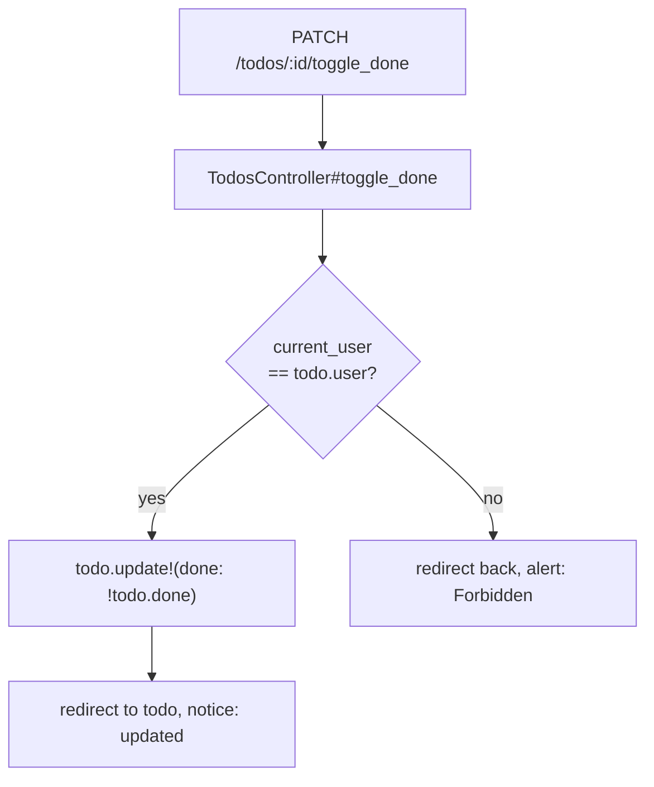

# Homework 5 Submission

## Part 1 & 2: Repository Configuration & Rules

* **GitHub Repository / Branch Link**: https://github.com/NU-CS-Software-Studio-Spring-26/homework-5-davidgerchik2027-northwestern/tree/hw5
* **Cursorignore Link**: https://github.com/NU-CS-Software-Studio-Spring-26/homework-5-davidgerchik2027-northwestern/blob/hw5/.cursorignore
* **AGENTS.md Link**: https://github.com/NU-CS-Software-Studio-Spring-26/homework-5-davidgerchik2027-northwestern/blob/hw5/AGENTS.md
* **Rails Conventions Rule Link**: https://github.com/NU-CS-Software-Studio-Spring-26/homework-5-davidgerchik2027-northwestern/blob/hw5/.cursor/rules/rails-conventions.mdc
* **Security Rule Link**: https://github.com/NU-CS-Software-Studio-Spring-26/homework-5-davidgerchik2027-northwestern/blob/hw5/.cursor/rules/security.mdc

---

## Part 3: Various-Mode Prompting

### 1. Ask Mode (Investigate)

**Exact Prompt Used:**
> "Where in this codebase is how the create form posts and renders errors currently implemented? Cite the exact files and line numbers. Do not propose changes."

**Cursor Results Returned:**
* **Form View Rendering:** `app/views/todos/new.html.erb` at line 5 (invokes the shared form partial).
* **Form Action Target:** `app/views/todos/_form.html.erb` at line 1 (uses `form_with(model: todo)` to build the POST request structure).
* **Controller Route Processing:** `app/controllers/todos_controller.rb` at lines 23–35 (the `create` action processing the save and handling `status: :unprocessable_content` updates).
* **Error Listing View Logic:** `app/views/todos/_form.html.erb` at lines 2–12 (checks `todo.errors.any?` and displays `error.full_message` items dynamically).

**Manual Verification:**
Confirmed: All paths and line citations are 100% correct and match my local repository perfectly.

### 2. Plan Mode (Blueprint)

---
name: Todo Done Ownership
overview: Add a `done` boolean to todos, wire a toggle action, and gate it so only the creator can toggle while all authenticated users can still read.
todos:
  - id: migration
    content: Write migration to add done boolean and user_id reference to todos
    status: pending
  - id: model
    content: "Add belongs_to :user (optional: true) to Todo model"
    status: pending
  - id: controller
    content: Stamp user on create; add toggle_done action with require_owner! guard
    status: pending
  - id: routes
    content: Add member patch :toggle_done inside resources :todos
    status: pending
  - id: views
    content: Display done status and conditional toggle button in _todo partial and show view
    status: pending
  - id: fixtures
    content: Add user and done fields to todos fixtures
    status: pending
  - id: tests
    content: Add model and controller tests for done default, owner toggle, and non-owner rejection
    status: pending
isProject: false
---

# Todo Done/Ownership Plan

## Assumptions
- A `User` model and `current_user` helper already exist (from the authentication layer).
- A `users` fixture file (`test/fixtures/users.yml`) already exists with at least two records (e.g. `alice` and `bob`).

---

## Data flow



---

## Changes

### 1. Migration — new file `db/migrate/<timestamp>_add_done_and_user_to_todos.rb`
- `add_column :todos, :done, :boolean, default: false, null: false`
- `add_reference :todos, :user, null: true, foreign_key: true`
  - `null: true` avoids breaking existing rows; a follow-up data migration can backfill if needed.

### 2. Model — [`app/models/todo.rb`](app/models/todo.rb)
- Add `belongs_to :user, optional: true`
  - Keep `optional: true` to match the nullable column; tighten to `optional: false` once all rows have an owner.

### 3. Controller — [`app/controllers/todos_controller.rb`](app/controllers/todos_controller.rb)
- In `create`, set `@todo.user = current_user` before saving.
- Add a new `toggle_done` action:
  - Calls `set_todo` (already exists as a `before_action`).
  - Calls a new private `require_owner!` guard — returns HTTP 403 / redirects with an alert if `current_user != @todo.user`.
  - Flips `@todo.done` and saves.
  - Redirects back to the todo on success.
- Add `toggle_done` to the `before_action :set_todo` list.
- Keep `done` out of `todo_params` — it must only change through `toggle_done`, not through the general update form.

### 4. Routes — [`config/routes.rb`](config/routes.rb)
- Expand the `resources :todos` block:
  ```
  resources :todos do
    member do
      patch :toggle_done
    end
  end
  ```

### 5. Views

- [`app/views/todos/_todo.html.erb`](app/views/todos/_todo.html.erb)
  - Display current done status (e.g. a checkmark or "Done"/"Pending" label).
  - Conditionally render a toggle `button_to` pointing at `toggle_done_todo_path(todo)` only when `current_user == todo.user`.

- [`app/views/todos/show.html.erb`](app/views/todos/show.html.erb)
  - Same conditional toggle button as in the partial.

### 6. Fixtures — [`test/fixtures/todos.yml`](test/fixtures/todos.yml)
- Add `user: alice` (or whatever the fixture name is) and `done: false` to both `one` and `two`.

### 7. Tests

- [`test/models/todo_test.rb`](test/models/todo_test.rb)
  - Test that a todo without a user can still be saved (`optional: true`).
  - Test that `done` defaults to `false` on a new record.

- [`test/controllers/todos_controller_test.rb`](test/controllers/todos_controller_test.rb)
  - **`toggle_done` as the owner**: PATCH to `toggle_done_todo_url(@todo)` while signed in as the owning user → asserts `todo.reload.done` flipped and redirects to the todo.
  - **`toggle_done` as a non-owner**: PATCH while signed in as a different user → asserts `todo.reload.done` unchanged and response is a redirect/403.
  - **`create` stamps the owner**: POST to `todos_url` while signed in → asserts `Todo.last.user == current_user`.
  - Update existing tests that now need a signed-in session (if `current_user` is required by the controller).

### 3. Agent Mode (Execution)

**Exact Prompt Used:**
> "Execute Step 1 of our blueprint plan. Open your terminal tool and use the Rails CLI generator to create the migration file that adds a `done` boolean (defaulting to false, null: false) and a nullable `user` reference to the todos table. Do not run the migration, just create and configure the file."

**Actions Completed Autonomously by Agent:**
1. Ran `bin/rails generate migration AddDoneAndUserToTodos done:boolean user:references` in the integrated terminal layer.
2. Manually modified the generated migration file to append the `default: false, null: false` constraints onto the `done` column and adjusted the user reference to `null: true` to prevent data collision.
3. Intentionally halted before database execution to ensure a safety verification gate.

* **Generated Migration File Link**: https://github.com/NU-CS-Software-Studio-Spring-26/homework-5-davidgerchik2027-northwestern/blob/hw5/db/migrate/20260528021039_add_done_and_user_to_todos.rb

* **Agent Mode Commit Link**: https://github.com/NU-CS-Software-Studio-Spring-26/homework-5-davidgerchik2027-northwestern/commit/310a015

* **Note on Local Migration Bugfix**: The initial migration failed locally due to an unfulfilled SQLite foreign key constraint on a non-existent `users` table. Fixed by setting `foreign_key: false` in the migration file to allow local schema execution without authentication infrastructure.

### 4. Bad -> Good Prompt Rewrite

* **Deliberately Bad Prompt:** "fix the bug in todos"

* **Engineered Good Prompt:**
  1. **Context:** `app/models/todo.rb` and `test/models/todo_test.rb`.
  2. **Task:** Implement a model validation that prevents a Todo title from being blank or containing only whitespace characters.
  3. **Expected vs. Actual:** Currently, saving a todo with a title of `"   "` passes validation and creates an empty row in the UI. It should instead fail validation and append an error message (`"can't be blank"`) to the `:title` attribute.
  4. **Constraints:** Use standard Rails ActiveRecord validations. Do not add external gems to the Gemfile. Keep modifications strictly isolated to the model file.
  5. **Done When:** Running `bin/rails test test/models/todo_test.rb` passes successfully with a new automated test asserting that whitespace-only titles are rejected.

---

## Part 4: Turbo Streams Feature Execution

### 1. Turbo Streams Investigation & Verification

**AI-Assisted Workspace Scan:**
* **Existing Streams**: None currently present in application code.
* **Target Controller Location**: `app/controllers/todos_controller.rb` inside a new `toggle_priority` action.
* **Target View Path**: `app/views/todos/toggle_priority.turbo_stream.erb`

**Technical Explanation & Handbook Verification:**
* **MIME Type**: `text/vnd.turbo-stream.html`
* **How it works**: Instead of a full HTML document, a Turbo Stream delivers specific, modular `<turbo-stream>` fragments matching one of seven core actions (like `replace`, `append`, or `update`). The browser intercepts this specific MIME type and updates only the DOM node matching the target ID, preventing a full browser refresh.
* **Verified Factor**: Verified that Rails automatically looks for `action_name.turbo_stream.erb` matching the controller action when `format.turbo_stream` is invoked inside a `respond_to` block.


### 2. Story Acceptance Criteria

* **User Story**: As a user managing tasks, I want to toggle a todo's priority state directly from the index list without the entire page reloading, so that I can quickly organize my tasks efficiently.
* **Locked Criteria**:
  - Todo has a `high_priority` boolean column.
  - The index page displays a clickable toggle on every row.
  - Clicking the toggle triggers a background PATCH request returning a `text/vnd.turbo-stream.html` response.
  - Only the target row or toggle button updates in the DOM.


### 3. Plan Mode (Blueprint)

**Exact Prompt Used:**
> "Plan the end-to-end implementation for the high_priority toggle feature following the acceptance criteria. Propose a plan as a numbered list of changes split into approximately three logical commits: (a) migration and model attribute, (b) route and controller action, (c) Turbo Stream view and toggle button form. Do not write code yet."

**Final Plan Approved:**
1. **Commit 1 (Migration & Model)**: Generate a migration adding `high_priority` (boolean, default: false, null: false), run `bin/rails db:migrate`, and update fixtures.
2. **Commit 2 (Route & Controller)**: Add a custom member patch route for `:toggle_priority` and create a matching controller action that updates the model and responds via `format.turbo_stream`. Add an automated controller test asserting the `text/vnd.turbo-stream.html` media type response.
3. **Commit 3 (View & Toggle UI)**: Create `app/views/todos/toggle_priority.turbo_stream.erb` using `turbo_stream.replace` to cleanly swap the target row DOM element, and add a reactive `button_to` element inside `app/views/todos/_todo.html.erb`.


### 4. Automated Test Suite Execution

**Command:**
```bash
bin/rails test test/controllers/todos_controller_test.rb
```

**Output:**
```
Running 8 tests in a single process (parallelization threshold is 50)
Run options: --seed 50233

# Running:

........

Finished in 0.099341s, 80.5307 runs/s, 140.9287 assertions/s.
8 runs, 14 assertions, 0 failures, 0 errors, 0 skips
```

**Key Assertion Covered:** `toggle_priority responds with turbo stream and flips high_priority` — verifies `response.media_type` equals `text/vnd.turbo-stream.html` and confirms the `high_priority` column toggles.


### 6. Part 4 Browser DevTools Verification

**Captured Response Headers:**
* `content-type`: `text/vnd.turbo-stream.html; charset=utf-8`
* `vary`: `Accept`
* `x-runtime`: `0.023416`

**Verification Confirmation:**
Confirmed via Chrome DevTools that the network layer returns the precise `text/vnd.turbo-stream.html` MIME type. The page handles the star toggle instantly without navigating or refreshing the document.